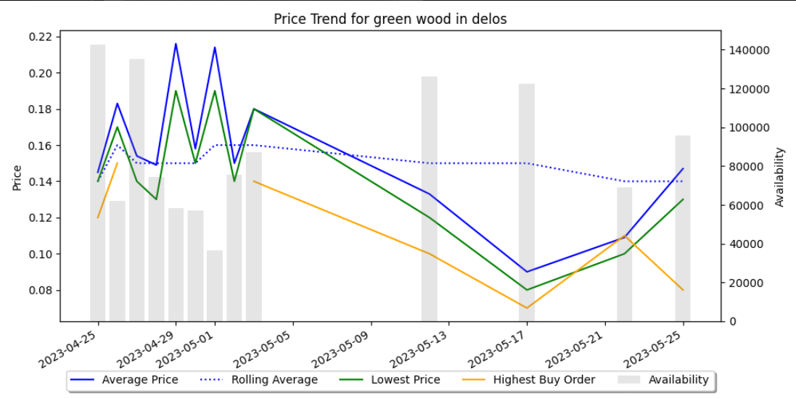

# 5ConClub
A discord bot for the new world game group 5ConClub

## Commands

### /GetPrice
Params: 
   item_name: str
   server_name: str
   


### /GetPriceGraph
Params: 
   item_name: str
   server_name: str
   



## Running locally

You'll need to installl the following python modules using PIP

```bash
pip install discord.py aiohttp matplotlib
```

You will need to create a bot in the Discord developer portal and get your own token which is used at the bottom of the script ```main.py```

Then run the script

```bash
python3 main.py
```

## Running in a Docker container

```bash
docker build -t 5conclub .
```

```bash
docker run -d 5conclub
```
