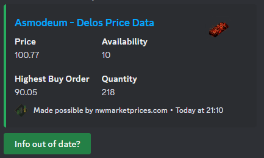

# 5ConClub


A discord bot for the new world game group 5ConClub.

## Examples  

### Example 1

The below command will return the lowest sell price and the quantity as well as the highest buy order and it's quantity for Asmodeum on delos

```yaml
/getprice item_name: asmo server_name: delos
```

#### Example 2

The below command will return a graph with the average price, rolling average, lowest price, the highest buy order, and the overall quantity of Ironwood on Barri

```yaml
/getpricegraph item_name: Ironwood server_name: Barri
```

---

## GetPrice


### PARAMETERS

#### Item_Name

The name of the item you would like to search for. Fuzzy matching applies meaning you don't need to search for the entire word for it to be found e.g. asmo will find asmodeum.

```yaml
Type: String
Required: True
Position: 1
Default value: N/A
```

#### Server_Name

The name of the server you would like to search on. Fuzzy matching applies meaning you don't need to search for the entire server name for it to be found e.g. el do will find El Dorado.

```yaml
Type: String
Required: True
Position: 2
Default value: N/A
```
   


## GetPriceGraph
  
*Example of a graph for Asmodeum on Delos using the night mode style*  


### PARAMETERS

#### Item_Name

The name of the item you would like to search for. Fuzzy matching applies meaning you don't need to search for the entire word for it to be found e.g. asmo will find asmodeum.

```yaml
Type: String
Required: True
Position: 1
Default value: N/A
```

#### Server_Name

The name of the server you would like to search on. Fuzzy matching applies meaning you don't need to search for the entire server name for it to be found e.g. el do will find El Dorado.

```yaml
Type: String
Required: True
Position: 2
Default value: N/A
```

#### Dark_Mode

Changes the colour scheme of the graph to be either dark or light.

```yaml
Type: Boolean
Required: False
Position: 3
Default value: False
```

## GetServerPop

  

### PARAMETERS

#### Server_Name

An array of server names seperated by a comma. Fuzzy matching applies meaning you don't need to search for the entire server name for it to be found e.g. el do will find El Dorado.

```yaml
Type: Array[String]
Required: True
Position: 1
Default value: N/A
```

#### Stat_Type

The type of math function you would liek to use to mdisplay the data. The options are Mean, Min, Max, and Average.

```yaml
Type: String
Required: True
Position: 2
Default value: Mean
```

#### Dark_Mode

Changes the colour scheme of the graph to be either dark or light.

```yaml
Type: Boolean
Required: False
Position: 3
Default value: False
```

---

## Running locally

You'll need to installl the following python modules using PIP

```bash
pip install discord.py aiohttp matplotlib requests fuzzywuzzy[speedup] python-dotenv
```

You will need to create a bot in the Discord developer portal and get your own token which is used at the bottom of the script ```main.py```

Then run the script

```bash
python3 main.py
```

## Running in a Docker container

```bash
docker build -t 5conclub .
```

```bash
docker run -d 5conclub
```
